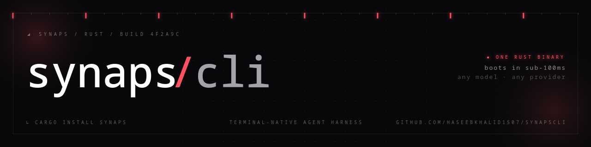

<p align="center">
  
</p>

<h3 align="center">Lightning fast terminal-native agent runtime</h3>

<p align="center">
  <a href="https://crates.io/crates/synaps"></a>
  
  <a href="https://ratatui.rs/"></a>
  
  <a href="LICENSE"></a>
  <a href="https://discord.gg/JCdgRYqVDP"></a>
</p>

<p align="center">
  Run AI agents from one binary. Tools, subagents, and extensions built in.<br>
  Any model, 20MB, 20ms cold start.
</p>

---

<!-- TODO: replace with the hero demo GIF (see task #115): single strong view, high contrast, app not shell -->
<p align="center">
  
</p>

Synaps is an agent runtime written in Rust. It runs agents with built-in tools, subagents, and extensions against any model, from Claude and ChatGPT to a local Ollama. The terminal UI is one client of the engine: `synaps rpc` speaks JSON-RPC over stdio, so other programs can drive it. Extend it with plugins in any language and MCP servers.

---

## Install

```bash
cargo install synaps              # crates.io
```

<details>
<summary>More options (brew, AUR, .deb, shell installer, source)</summary>

```bash
brew install HaseebKhalid1507/tap/synaps    # macOS / Linux
yay -S synaps                               # Arch / EndeavourOS

# Debian/Ubuntu
curl -LO https://github.com/HaseebKhalid1507/SynapsCLI/releases/latest/download/synaps_amd64.deb
sudo dpkg -i synaps_amd64.deb

# Shell installer (any platform)
curl -sSL https://github.com/HaseebKhalid1507/SynapsCLI/releases/latest/download/synaps-installer.sh | sh

# From source
git clone https://github.com/HaseebKhalid1507/SynapsCLI && cd SynapsCLI
cargo build --release && ./target/release/synaps
```
</details>

*New to agents? Start with the [ELI5](ELI5.md). Want the full tour? The [Wiki](https://github.com/HaseebKhalid1507/SynapsCLI/wiki) has 36 pages.*

---

## Quick start

```bash
synaps login          # OAuth, cloud credentials, provider keys, or local Ollama
synaps                # launch the TUI
```

### Sign in with what you already pay for, use cloud identity, or run locally

```bash
synaps login                      # searchable picker: OAuth, cloud, and API-key providers

# Subscription OAuth
synaps login --provider claude
synaps login --provider openai-codex
synaps login --provider xai-auth
synaps login --provider github-copilot
synaps login --provider google-gemini  # requires a Synaps-owned Google Desktop OAuth client registration

# Static API key
synaps login --provider kimi            # Moonshot AI (MOONSHOT_API_KEY / KIMI_API_KEY)

# Cloud identity; credentials remain broker-owned
synaps login --provider azure-openai
synaps login --provider aws-bedrock
synaps login --provider google-vertex

# Then choose an exact provider-qualified model
synaps                            # /model openai-codex/gpt-5.5

# Ollama or any local model (no account, no key, no cloud)
ollama serve                      # LM Studio, vLLM, llama.cpp all work too
synaps                            # /model local/llama3.2
```

OAuth and cloud credentials flow through the typed credential broker; long-lived tokens and cloud secrets are not handed to model runtimes. Availability still depends on each upstream account, entitlement, cloud registration, IAM policy, region, and quota. Cloud broker routes (Azure OpenAI, Amazon Bedrock, Google Vertex AI) are currently **text-only**: they are marked `text-only` in model listings, and a mode that requires tools fails with a typed unsupported-capability error before any credential use or network access.

Synaps auto-targets `http://localhost:11434/v1`, which is Ollama's default, so a running Ollama just works. Point it anywhere else with `provider.local.url` in config or the `LOCAL_ENDPOINT` env var. Your keys, your box, nothing phones home.

---

## Why Synaps

- **Agents are not chat.** They're autonomous programs that happen to use language models. Treat them like services.
- **Own your agent.** The system prompt is a file on disk. The tool list is opt-out. Your turns are yours; nothing phones home.
- **Multi-agent is the default.** Single-agent is just n=1.
- **Speed is a feature.** A 2-second boot already lost the dev who wanted it in a git hook.
- **The terminal is the IDE.** If you need Electron to be productive, your tools are wrong.

## What's in the box

- **Run a crew.** Named agents with roles, dispatched in parallel, thinking in a live panel. Steer one mid-flight without killing it.
- **Runs without you.** `synaps watcher` supervises fleets: heartbeats, crash recovery, cost limits. Half the sessions on my machine have no human in them.
- **Credentials stay in the broker.** Agents get short-lived, scoped tokens. A compromised agent can't leak what it never held.
- **Bounded turns.** Caps on tool calls, wall clock, tokens, bytes, and cost. An agent can't spend what you didn't give it.
- **Memory that survives.** Project-scoped memory, `/compact` checkpoints, sessions that chain across days.
- **Any model.** Claude, Codex, Grok, Copilot, Gemini, Kimi, Azure, Bedrock, Vertex, any OpenAI-compatible endpoint, or the Ollama on your box. Starts with zero credentials. Routes that can't work fail closed.
- **Build on it.** Process-isolated extensions in any language, MCP servers, custom tools. A small core with enough hooks to bolt on whatever you want and glue it to whatever you've got.
- **Lean is fast.** One 20MB binary, 20ms cold start. No framework tax, no interpreter warming up.
- **19 themes.** `catppuccin`, `gruvbox`, `nord`, `tokyo-night`, plus originals like `neon-rain` and `night-city`. Hot-swap with `/theme`.

## Modes

| Command | What it does |
|---------|-------------|
| `synaps` | The TUI. Streaming, markdown, a live subagent panel |
| `synaps chat` | Same engine, stdin/stdout. Pipes, scripts, CI |
| `synaps rpc` | JSON-RPC over stdio. Embed the engine in other software |
| `synaps server` | WebSocket API: token auth, origin validation, streaming |
| `synaps watcher` | Supervisor for unattended fleets: heartbeats, restarts, cost limits |
| `synaps auth-broker` | One credential, many machines. Short-lived tokens over TLS |

## Configuration

One file, `key = value`, at `~/.synaps-cli/config`:

```ini
model = anthropic/claude-sonnet-4-6
thinking = high
theme = tokyo-night
identity = You are a senior engineer who writes clean, tested code.
disabled_tools = bash, ls          # remove built-ins at boot (read-only profiles)
provider.groq = gsk_...
```

<details>
<summary>Advanced: shared-credential broker, bridge mirror, all keys</summary>

See the [Wiki](https://github.com/HaseebKhalid1507/SynapsCLI/wiki) for the full config reference, the multi-machine **auth broker** (share one OAuth credential across a fleet over WireGuard or TLS), and the bridge heartbeat mirror.
</details>

---

## Extensions

Drop a folder in `~/.synaps-cli/plugins/` and it's live on next boot:

```
~/.synaps-cli/plugins/my-guard/
├── .synaps-plugin/plugin.json    # manifest: hooks, permissions, keybinds
└── main.py | index.js | <any>    # JSON-RPC 2.0 over stdio, any language
```

Extensions are separate processes speaking JSON-RPC over stdio: any language, crash-isolated, with a permissions manifest gating what each one can touch. Seven lifecycle hooks, from `before_tool_call` to `on_session_end`.

Protocol spec: [docs/extensions/](docs/extensions/).

---

## Contributing

Synaps is young (started April 2026) and moving fast: 1,900+ commits in its first 3 months, shipped to crates.io, Homebrew, and the AUR, and listed in [awesome-ratatui](https://github.com/ratatui/awesome-ratatui). Good first contributions: a new provider in the catalog, an extension, a theme, docs, or any [`good first issue`](https://github.com/HaseebKhalid1507/SynapsCLI/labels/good%20first%20issue).

```bash
git clone https://github.com/HaseebKhalid1507/SynapsCLI && cd SynapsCLI
cargo build && cargo test
```

See [CONTRIBUTING.md](CONTRIBUTING.md). Issues and PRs welcome, the maintainer answers fast.

Come hang out in the [**Synaps Discord**](https://discord.gg/JCdgRYqVDP) — questions, ideas, show-and-tell, or just to watch the crew run.

---

## Architecture

```
crates/
├── agent-core/      # provider identity, auth broker, models, prompts, orchestration policy
├── agent-engine/    # provider transports, runtime, worker lifecycle, tools, extensions
│                   # MCP, events, skills, sidecar, cloud and OpenAI-compatible routing
├── agent-tui/       # ratatui UI, model/effort settings, themes, plugin modals
└── (root)           # the `synaps` binary crate: CLI dispatch, login, watcher, broker
```
Native Anthropic, OpenAI Responses/chat, Gemini Code Assist, and cloud-provider transports all emit the same `StreamEvent`, so the TUI and tool loop stay provider-blind. Provider-qualified identities and pre-authorized execution plans remain typed through routing.

---

## License

Apache 2.0. See [LICENSE](LICENSE).

<p align="center">
  <sub>Synaps is built with Synaps.</sub>
</p>

<p align="center">
  <sub>Because every other CLI agent was a 400MB Electron app pretending to be a terminal tool.</sub>
</p>
