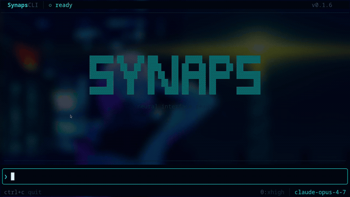

<p align="center">
  
</p>

<h3 align="center">The agent runtime that boots before your Node binary finishes importing.</h3>

<p align="center">
  <a href="https://github.com/HaseebKhalid1507/SynapsCLI/stargazers"></a>
  <a href="https://crates.io/crates/synaps"></a>
  
  <a href="LICENSE"></a>
</p>

<p align="center">
  One Rust binary. Any model. Any provider.
</p>

---

<!-- TODO: Replace with demo GIF/video -->
<p align="center">
  
</p>

---

## Install

```bash
cargo install synaps              # crates.io
```

<details>
<summary>More options</summary>

```bash
brew install HaseebKhalid1507/tap/synaps    # macOS / Linux
yay -S synaps                               # Arch / EndeavourOS
```

```bash
# Debian/Ubuntu
curl -LO https://github.com/HaseebKhalid1507/SynapsCLI/releases/latest/download/synaps_amd64.deb
sudo dpkg -i synaps_amd64.deb
```

```bash
# Shell installer (any platform)
curl -sSL https://github.com/HaseebKhalid1507/SynapsCLI/releases/latest/download/synaps-installer.sh | sh
```

```bash
# From source
git clone https://github.com/HaseebKhalid1507/SynapsCLI && cd SynapsCLI
cargo build --release && ./target/release/synaps
```

</details>

## Go

```bash
synaps login                      # OAuth with Claude Pro/Max
synaps                            # launch
```

Or skip OAuth — any API key works:

```bash
export ANTHROPIC_API_KEY="sk-ant-..."   # or GROQ_API_KEY, CEREBRAS_API_KEY, etc.
synaps
```

17 providers. 55+ models. Set a key, pick a model, go.

---

## What It Looks Like

<!-- TODO: screenshot of TUI with subagent panel -->

```
╭ ◈ 4 agents ────────────────────────────────────╮
│  ✓ spike    done                         12.3s  │
│  ⠹ chrollo  ⚙ read (tool #5)              8.1s  │
│  ✓ shady    done                          9.7s  │
│  ⠹ zero     thinking...                   4.2s  │
╰─────────────────────────────────────────────────╯
```

You dispatch agents. They work in parallel. You watch them think.

---

## The Pitch

Most CLI agents are single-threaded conversations with a language model. Synaps is a **runtime** — a place where multiple named agents live, collaborate, and persist across sessions.

```bash
# Dispatch a named agent with its own personality and tools
subagent(agent: "spike", task: "refactor the auth module")

# Or dispatch reactively — don't wait, steer mid-flight
subagent_start(agent: "chrollo", task: "audit this codebase for vulnerabilities")
subagent_steer(handle: "sa_1", message: "focus on the API routes")
subagent_collect(handle: "sa_1")
```

Agents aren't anonymous forks. They're crew members with names, system prompts, specializations, and memory. You build a team, not a chatbot.

---

## Features

**⚡ Fast.** ~70K lines of Rust. Sub-100ms cold start. Single binary, no runtime dependencies.

**🌐 Any model.** Claude, GPT-4, Gemini, Llama, Qwen, Mistral, DeepSeek — 17 providers including free tiers (Groq, Cerebras, NVIDIA NIM). Swap mid-session with `/model`.

**🎭 Named agents.** `spike`, `chrollo`, `shady`, `zero` — each with a soul. Dispatch by name, watch them work in the live panel.

**🔄 Reactive orchestration.** Dispatch → poll → steer → collect. Five tools that turn fire-and-forget into collaborative multi-agent workflows.

**📡 Event bus.** Push events into a running session from any script, cron, or service. The agent reacts in real time.

**🔌 Extensions.** JSON-RPC 2.0 over stdio. Hook into `before_tool_call`, `after_tool_call`, `before_message`, `on_session_start`, `on_session_end`. Build guardrails, inject context, modify tool calls.

**🧠 Context that lasts.** 90%+ prompt cache hit rate. `/compact` replaces history with a structured checkpoint. Chain sessions across days.

**🤖 Autonomous mode.** `synaps watcher` supervises long-running agents with heartbeats, crash recovery, cost limits, and session handoff.

**🎨 18 themes.** From `neon-rain` to `tokyo-night`. Hot-swap with `/theme`.

---

## Modes

| Command | What it does |
|---------|-------------|
| `synaps` | Interactive TUI — streaming, markdown, syntax highlighting, subagent panel |
| `synaps chat` | Headless — same engine, stdin/stdout. For scripts, pipes, CI |
| `synaps server` | WebSocket API with token auth, origin validation, streaming |
| `synaps rpc` | Line-JSON IPC — one process per thread, for bridges (Slack, Discord) |
| `synaps watcher` | Supervisor daemon for autonomous agent fleets |

---

## Tools

18 built-in, zero config:

| | | |
|---|---|---|
| `bash` | `read` / `write` / `edit` | `grep` / `find` / `ls` |
| `subagent` / `subagent_resume` | `subagent_start` / `_status` / `_steer` / `_collect` | `shell_start` / `_send` / `_end` |
| `connect_mcp_server` | `load_skill` | |

Plus anything from MCP servers. `connect_mcp_server` and they're live.

---

## Configuration

```
~/.synaps-cli/config
```

```ini
model = claude-sonnet-4-6
thinking = high
theme = neon-rain
context_window = 200k

provider.groq = gsk_...
provider.cerebras = csk-...

keybind.F5 = /compact
```

That's it. No YAML. No TOML. No JSON. Key = value. Done.

---

## Extensions & Plugins

Drop a folder in `~/.synaps-cli/plugins/` — it's live on next boot.

Extensions hook into the agent loop via 5 lifecycle events. They can block tool calls, inject context, modify inputs, or just observe. Permission-gated. Sandboxed processes.

```
~/.synaps-cli/plugins/my-guard/
├── plugin.json        # manifest: hooks, permissions, keybinds
└── index.js           # JSON-RPC 2.0 over stdio
```

See [docs/extensions/](docs/extensions/) for the protocol spec.

---

## Philosophy

Synaps has opinions:

- **Agents are not chat.** They're autonomous programs that happen to use language models. Treat them like services, not conversations.
- **Speed is a feature.** If your agent runtime takes 2 seconds to boot, you've already lost the developer who wanted to use it in a git hook.
- **Multi-agent is the default.** Single-agent is a special case of multi-agent with n=1. The architecture should reflect that.
- **The terminal is the IDE.** If you need Electron to be productive, your tools are wrong.

---

<details>
<summary><b>Architecture</b></summary>

```
src/
├── main.rs          # CLI dispatch
├── engine/          # shared boot, commands, stream, session
├── runtime/         # LLM API + provider router (Anthropic native + OpenAI-compat)
├── tui/             # terminal UI, themes, settings, plugin modals
├── tools/           # 18 built-in tools
├── extensions/      # JSON-RPC extension system
├── events/          # event bus + priority queue
├── mcp/             # Model Context Protocol client
├── watcher/         # autonomous agent supervisor
└── skills/          # markdown-driven behavioral guidelines
```

Two API paths: Anthropic (native) and OpenAI-compatible (17 providers). Both emit the same `StreamEvent` — the TUI and tool loop are provider-blind.

</details>

---

## License

Apache 2.0. See [LICENSE](LICENSE).

---

<p align="center">
  Built by <a href="https://github.com/HaseebKhalid1507">Haseeb Khalid</a><br>
  <sub>Because every other CLI agent was a 400MB Electron app pretending to be a terminal tool.</sub>
</p>
